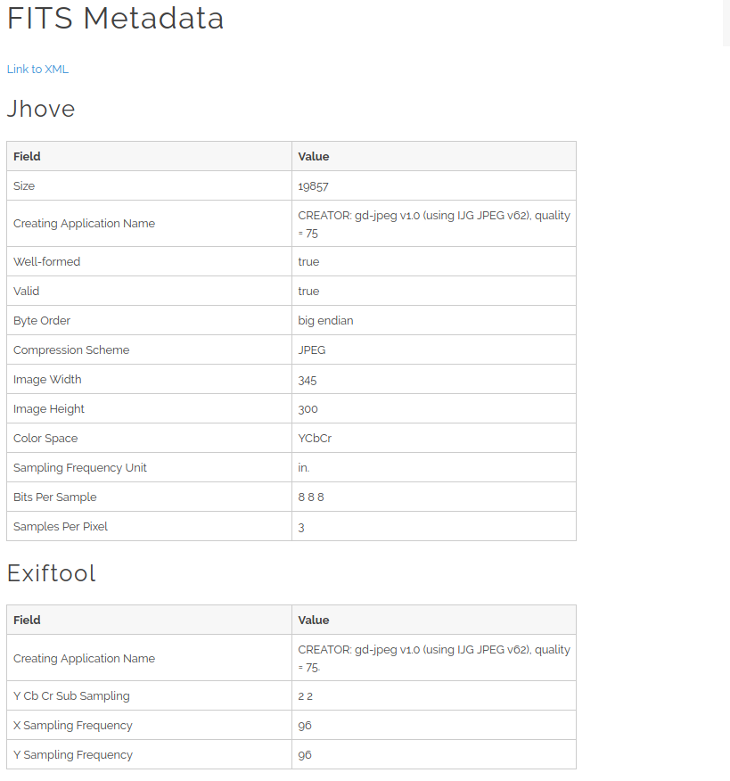
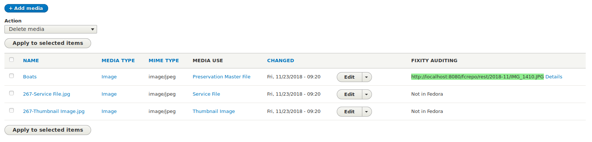
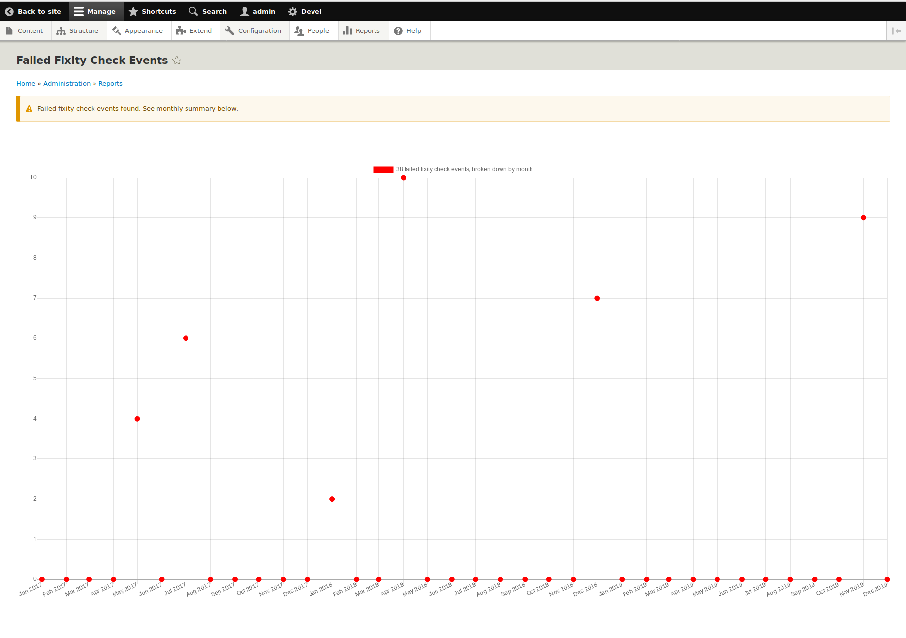
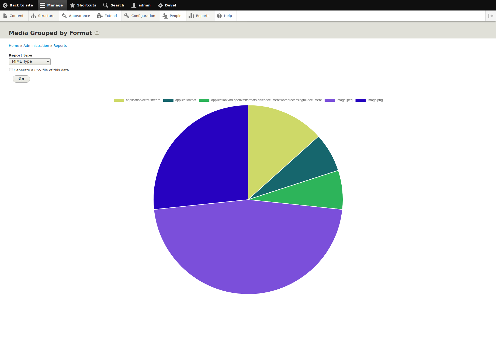

# Digital Preservation Using Islandora 8

## Overview

As a digital assets management system (DAMS), Islandora provides a wide range of functionality, from ingest to storage to management to presentation. Islandora offers a number of digital preservation capabilites that add value to its storage and management functions in particular that distinguish it from other digital asset management platforms. Those tools include:

| Feature  | Purpose                         |
--------------- |------------------------------------                           |
| Fedora repository | Provides the storage layer for Islandora, and Islandora leverages a number of Fedora's features to provide digital preseration services. |
| Islandora FITS | Drupal module that uses the FITS characterization tool to derive technical and format information from Islandora media.
| Riprap | This tool, plus the accompanying Islandora Riprap Drupal module, enables periodic fixity checking on Islandora media.
| Islandora Bagger | Command-line tool that produces Bags for Islandora objects and media. Accompanying Islandora Bagger Integration module. |
| Islandora PREMIS | Combines data from a number of sources (including Ripap and FITS) and provide that data such that it conforms with the PREMIS preservation metadata standard. |
| Media Formats Reports | Provides a graphical breakdown of the media types (MIME type or PRONOM PUID) in use in an Islandora repository. |

These features not only add value to Islandora's storage and managment functionality, they enable it to integrate with other systems that specialize in digital preservation. For example, it is possible to integrate Islandora and Archivematica. One type of integration is to have Islandora generate Bags that are then used to [transfer the content into Archivematica](https://www.archivematica.org/en/docs/archivematica-1.10/user-manual/transfer/bags/#bags) for further processing.

## Islandora and Digital Preservation Policies

In addition to supporting robust digital asset mananagment, Islandora's digital preservation features can be used to implement technical aspects of institutional digital preservation policies. "Policy" in this context is a formal statement of what an institution is doing to ensure long-term access to its digital assets. Digital preservation stratgy comes into play at an even higher level, but policies are where an institutions expresses what its says it is doing to safeguard future access to its digital assets of enduring value. Essentially, your digital preservation policy says what you are doing (often in the form of "action plans"), and Islandora's digital preservation features enable you to do what you say you are doing. York University's [digital preservation policy](https://digital.library.yorku.ca/tags/digital-preservation-policy) and [action plans](https://digital.library.yorku.ca/tags/preservation-action-plan) are an excellent example to emulate.

Digital preservation's relationship to standard backups is that digital preservation relies on robust backups but does not replace them. Neither do robust backups replace digital preservation. Digital preservation adds value to robust backups. Also, standard backup processes tend to focus on short-term access to files (generally in 1 week, 1 month, 3 month, and 1 year periods, or some variation of those timespans). Digital preservation has a much longer view on ensuring that content remains accessible. If you want to ensure that your digital assets are accessible in 50 years, standard backups are not going to be much help.

### Read This! This is Important!

Notice the phrase in the first paragraph in this section "technical aspects of institutional digital preservation policies". Digital preservation succeeds in direct proportion to institutional committment, and will not work in the absence of active committment to make an institution's digital assets accessible in the future. Simply turning on Islandora's digital presrvation features does not mean an institution is doing digital preservation. The same can be said for any platform or tool that supports digital preservation - just turning it on it not enough. The technical capabilities Islandora (or Archivematica for that matter) provides only enable institutions to implement their digital preservation policies and action plans. That's all they do. It is up to institutions to ensure (via adequate staffing levels, financial planning, and effective collaborations with other institutions) that every aspect of their policies do what they are supposed to.

## A Closer Look at Islandora's Digital Preservation Features

### Fedora repository

Fedora Repositor provides a robust storage layer for Islandora. While Drupal also provides its own storage capabilities in its public and private filesystems, and also provides integration with a wide variety of external storage platforms such as Amazon and Azure, most Islandora repositories will want to use Fedora to store original files and any other files of enduring value. Easily reproduced dertivatives, such as thumbnails, are probably not worth storing in Fedora, but what media get stored in Drupal and what media get stored in Fedora is configurable by Islandora administrators.

Fedora also provides additional services that support Islandora's digital preservation capabilities, such as checksum generation, which is used by Islandora Riprap (more below).

### Islandora FITS

[FITS](https://projects.iq.harvard.edu/fits/home) (the File Infomation Tool Set) identifies, validates and extracts technical metadata for a wide range of file formats. Many digital preservation activities depend on the information generated by FITS, for example, during format migrations. But, FITS' ability to validate a file according to a formal file format specification is extremely important, since invalid files may not render properly in user-facing software, and might not be convertable to other formats now and in the future.

FITS provides a general framework for integrating a number of specialized tools. These tools include the DROID format validation tool (which validates files against known format signatures) and the ExifTool technical metadata extraction tool. The Islandora FITS module persists the output from FITS as a Drupal media and also provides a simplified view of this information for easy inspection:




### Islandora Riprap

Riprap is a general (not specific to Islandora) fixity validation tool that is easy to integrate with Islandora repositories via the Islandora Riprap module. Riprap periodically validates the fixity of media, but the Drupal module provides users with reports that allow them to monitor fixity information at the object level:



and at the repository level:



You do not want to see a chart with so many fixity check failures! Ideally, Riprap would not detect any fixity check failures. If that is the case, Islandora Riprap will tell you your storage is working as intended:


### Islandora Bagger

Islandora Bagger, as its name suggests, generates [Bags](https://en.wikipedia.org/wiki/BagIt) for Islandora objects. It is a command-line tool suitable for integration in preservation workflows, but an accompanying Drupal module provides end users with the ability to create Bags on demand and also for administrative users to create Drupal Contexts which generate Bags in response to system events. A typical Bag for an Islandora object could look like this (depending on the options specified when the Bag was created):

```
/output/112
├── bag-info.txt
├── bagit.txt
├── data
│   ├── IMG_1410.JPG
│   ├── media.json
│   ├── media.jsonld
│   ├── node.json
│   ├── node.jsonld
│   ├── metadata
│   │   └── MODS.xml
│   ├── metadata.csv
│   ├── media_use_summary.tsv
│   └── node.turtle.rdf
├── manifest-sha1.txt
└── tagmanifest-sha1.txt
```

### Islandora PREMIS


### Media Formats Reports

An important aspect of repository management is being able to determine what types of files are in a repository. This information is invaluable when determining how many files in the repository are in formats that are at some risk (e.g., the formats are becoming less commonly used and are therefore at risk of becoming obsolete), or when plannig for format migrations. The Media Formats Reports module provides this information using multiple definitions of "format", specifically, [MIME type](https://en.wikipedia.org/wiki/Media_type) and [PRONOM PUID](https://en.wikipedia.org/wiki/PRONOM). It presents this information as a pie chart that allows repository administrators to see at a glance how many files of each format exist in their repositories:




## Islandora's Place in Your Institution's Digital Preservation Strategy

Using Islandora's preservation capabilities without considerting the broader policy context is not enough to ensure enduring access to digital assets. Digital preservation requires a strategy, not just a set of tools. A strategy includes policies, and institutional commitment in the form of resources, to support those policies. Action plans describe detailed processes and tools used to implement preservation policies. Insitutions that use Islandora 8 as a DAMS have a robust set of tools to support these higher level aspects of digital preservation. 
